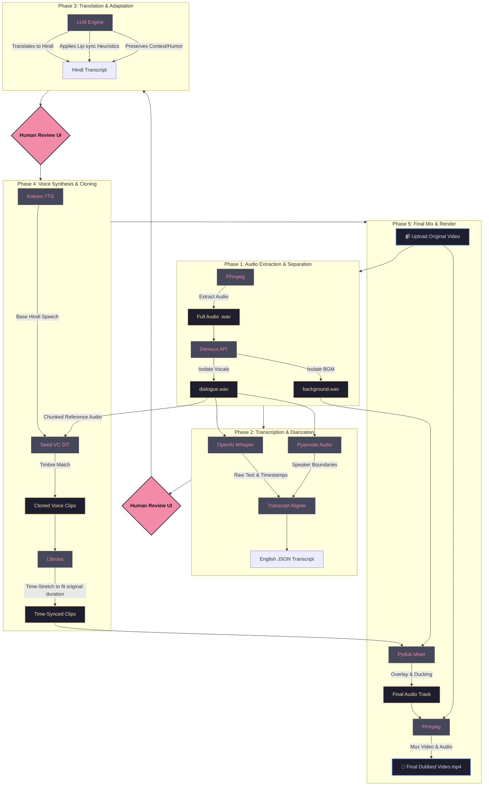

# NaturalDub-AI: Processing Pipeline Flow

The entire dubbing architecture is divided into **5 distinct phases**. The system uses a multi-agent backend to orchestrate specialized AI models (Whisper, Demucs, Pyannote, Kokoro, Seed-VC) for cinematic-quality auto-dubbing.

---

## Detailed Breakdown

### 1️⃣ Phase 1: Audio Extraction & Separation
* **Goal**: Isolate the human dialogue from the background noise, music, and sound effects.
* **Technology**: We use **FFmpeg** to extract the `.wav` file, and **Demucs (htdemucs)** to separate it into isolated stems. 
* **Output**: `dialogue_audio.wav` (clean vocals) and `background_audio.wav` (BGM/Noise).

### 2️⃣ Phase 2: Transcription & Diarization
* **Goal**: Figure out *what* is being said, *when* it is said, and *who* is saying it.
* **Technology**: **OpenAI Whisper** generates the text script with exact millisecond timestamps. **Pyannote Audio** listens to the vocal pitch to determine how many different people are talking (`SPEAKER_00`, `SPEAKER_01`, etc). The backend mathematically merges these two outputs.
* **Review**: The system pauses and waits for you to review and fix any misheard words in the UI.

### 3️⃣ Phase 3: Translation
* **Goal**: Translate the English dialogue into natural, fluent Hindi while maintaining constraints.
* **Technology**: An **LLM** (Groq/Llama-3) is prompted with strict heuristics. It tries to match the syllable count of the Hindi translation to the English original to make the final lip-sync look as natural as possible without visual manipulation.
* **Review**: The system pauses for you to review the Hindi translation in the UI.

### 4️⃣ Phase 4: Voice Synthesis (Zero-Shot Cloning)
* **Goal**: Generate the Hindi audio using the exact voice timbres of the original speakers.
* **Technology**: 
    1. **Kokoro-TTS** generates incredibly fluent, hyper-realistic base Hindi speech.
    2. **Seed-VC** (a Diffusion Transformer model) uses small reference chunks of the original `dialogue_audio.wav` to clone the speaker's vocal characteristics and injects that timbre directly into the Kokoro-generated audio.
    3. **Librosa** mathematically stretches or shrinks the generated audio clip so its duration matches the original English clip down to the millisecond.
* **Fallback**: If Seed-VC fails, it falls back to standalone Kokoro-TTS -> ElevenLabs API -> Azure Neural TTS.

### 5️⃣ Phase 5: Audio Mixing & Rendering
* **Goal**: Put everything back together into a cinematic video.
* **Technology**: **Pydub** takes all the time-synced cloned voice clips and places them perfectly on an empty timeline based on their timestamps. It then overlays the `background_audio.wav` underneath, optionally lowering the background volume when people are speaking (Audio Ducking). Finally, **FFmpeg** stitches this new audio track back onto the original video file.
